<script> 
    $(document).ready(function() { 
    $head = $('#header'); 
    $head.prepend('<A href = https://www.cuttingedge-events.com></A>') 
    }); 
</script> 


```{r echo=FALSE, message=FALSE,warning=FALSE}
library(readxl)
library(shiny)
library(dplyr)
library(knitr)
```


## Accommodation 🏨

### **Confirmed: Hotel Barcelona Princess**

**Barcelona Princess Hotel** is a 10-minute walk from the beach in the city’s Forum area. It offers wonderful views, a free sauna and a gym. Free WiFi is available throughout.

All guests have free access to the 2 heated outdoor pools. The one on the 23rd floor offers spectacular sea views.

Rooms at Princess Barcelona are elegant and bright. Each has contemporary décor. All rooms have satellite TV and offer free drinks from the minibar.

The bathrooms have a glass wall to separate the bed area from the sink but it is a black blind and the toilet and the shower are separated, each one with its own door.

**Princess Hotel Barcelona** is set on Avenida Diagonal, next to Diagonal Mar Shopping Centre. The tour bus stops in front of the hotel and Maresme Forum Metro Station is 100 m away.

  


<style>
p.comment {
background-color: #ffcc99;
padding: 10px;
border: 1px solid black;
border-radius: 5px;
}
</style>

<p class="comment">
**Confirmed 150 TWIN rooms, breakfast inc - 231€ VAT inc per room**.</p>

<style>
p.comment {
background-color: #ffcc99;
padding: 10px;
border: 1px solid black;
border-radius: 5px;
}
</style>

<p class="comment">
Tursitic tax: 1,21€ per person and night VAT inc.</p>


## Activities {.tabset .tabset-fade .tabset-pills}

### **Operation Christmas Child** 

The activity consist in set up and customize one box per participant.  All the boxes will have the same size and color, they will be new and each participant will have to set it up, then, they will put a sticker on it and they will need to choose if the box will be delivered to a girl or a boy and the age.

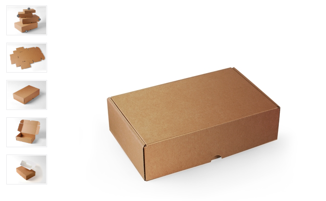 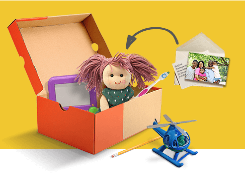

Depending on the age and sex they will find different gifts that they will put inside the box, apart from the gifts, the organization asks to add a hand-written letter and a personal gift (if it’s possible).

The box will be finished and ready to send once it will be filled, with a customized decoration of each one of the participants and with the sticker (boy/girl) on it.

The organization ask for a  minimum donation of 6€ per box that will be used to organize the transportation and delivery.

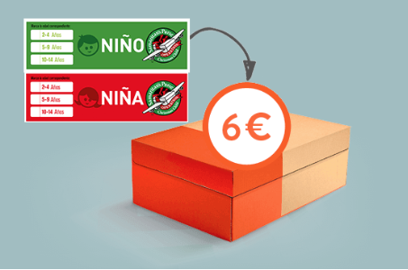 

The boxes will be transferred to different countries. It will be possible to receive a video when the organization will be given the boxes.

<style>
p.comment {
background-color: #ffcc99;
padding: 10px;
border: 1px solid black;
border-radius: 5px;
}
</style>

<p class="comment">
The cost of the activity  would be a minimum of 25€ per person, including the box, the gifts to be put inside - 6€ donation (mandatory).</p>

<style>
p.comment {
background-color: #ffcc99;
padding: 10px;
border: 1px solid black;
border-radius: 5px;
}
</style>

<p class="comment">
It is not included the rental of the space/venue where we will organize the activity.
Not included the transfer.</p>


 


* Suggested Venue: Hotel Barcelona Princess 

To do this activity the first option would be to use the Hotel Princess meeting rooms:

 

All the orange area is more than 400sqm that will be used for the activity. These meeting rooms are separated by panels so, for this activity they will be open making one space. Some of them have big windows so, as they will be open all the area will have natural lighting.

 

<style>
p.comment {
background-color: #ffcc99;
padding: 10px;
border: 1px solid black;
border-radius: 5px;
}
</style>

<p class="comment">
The cost of the rental of the space (Forum +  Mediterraneo + Princess 1 and 2+ Foyer + Diagonal) will be 1700€ VAT inc.</p>

<style>
p.comment {
background-color: #ffcc99;
padding: 10px;
border: 1px solid black;
border-radius: 5px;
}
</style>

<p class="comment">
Optional: AV needed to project during 20/30 minutes an introduction of the activity for the whole group at the same time, including different screens, soundsystem, technician: 1650€ VAT inc .</p>

After the activity guests will be transferred to the restaurant for dinner

****

### **Eco-hiking** 

The 24th October after the check-out at Hotel La Mola, they will be transfered to Coll d'Estenalles Parking (around 25 minutes)

 

 

At Coll d’Estenalles guests At will meet our staff, we will give them the information of the activity, the natural park, a pair of gloves, baseball caps and big bags to collect the trash. 

We will split guests in teams of 30 pax - each group will have 1 assistants/guides who will help them during the activity. 
When they will have their bags full, they will have to return to the starting spot (Coll d’Estenalles) where they will find some people of our staff and trucks to collect the bags. 

Is a team-work so they will have a global goal: to pick up the maximum amount of trash and let this beautiful park as clean as possible.

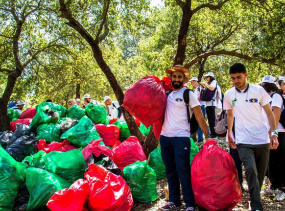 

 

<style>
p.comment {
background-color: #ffcc99;
padding: 10px;
border: 1px solid black;
border-radius: 5px;
}
</style>

<p class="comment">
**The cost of the activity will be 30€ per pax VAT inc.** including 1 guide/assistant each 30 pax, staff to pickup the trash at Coll d'Estenalles, Material needed for the activity (bags, gloves and other materials, Trash trucks to carry the trash to the dumping site, Dumping site taxesm Natural Park taxes and permission - maps and information needed to organize the activity </p>


<style>
p.comment {
background-color: #ffcc99;
padding: 10px;
border: 1px solid black;
border-radius: 5px;
}
</style>

<p class="comment">
Not included: 50 seaters bus at disposal for the activity from/to la Mola hotel: 470,25€ VAT inc, per bus. </p>

<style>
p.comment {
background-color: #ffcc99;
padding: 10px;
border: 1px solid black;
border-radius: 5px;
}
</style>

<p class="comment">
Optional: Customized Tshirts (from 5€ per unit) and Baseball caps (from 3€ per unit) </p>

****
### **Animal Shelters Help** 

The idea is to split guests in 6 groups of 50 pax - each group will go to a different animal shelter. 
All the animal shelters that we propose are located from 20 to 45 minutes from the hotel Princess in Barcelona.

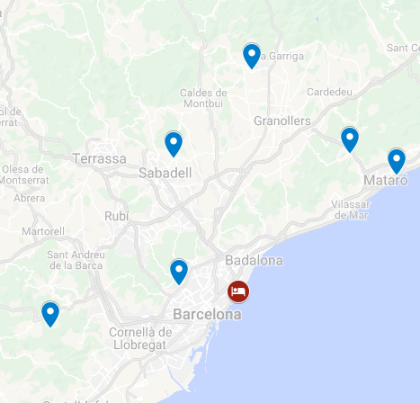 

The activity will be adapted to each shelter needs, we will  organize different activities at each shelter so guests will do them in turns.

  *Painting - we will buy paint cans, rollers and brushes and a group of 10/15 guests will be painting some of the facilities.

  *Cleaning - we will buy and donate brooms, dustpans, bleach and buckets and a group of 10/15 guests will be cleaning the facilities

  *Dog/cats cleaning and brushing - we will buy and donate brushes, scissors, gauzes, etc and a group of 10/15 pax will be helping the animals to be clean

  *Setting the animals’ places - we will buy and donate blankets and beds for the animals and one group of 10/15 will take care of this.

Depending on the shelter needs we will donate other materials as feed, sand for cats, office materials, etc.

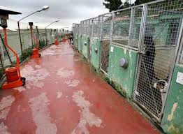 

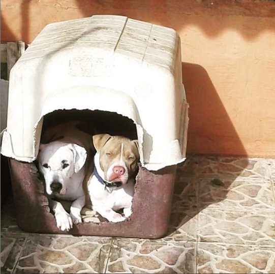 

<style>
p.comment {
background-color: #ffcc99;
padding: 10px;
border: 1px solid black;
border-radius: 5px;
}
</style>

<p class="comment">
**The cost of the activity will be 20€ per pax VAT inc.** including disposable work overalls and gloves and all the materials mentioned above. 1 Organization staff group of 50 pax.</p>

<style>
p.comment {
background-color: #ffcc99;
padding: 10px;
border: 1px solid black;
border-radius: 5px;
}
</style>

<p class="comment">
Not included: 50 seaters bus at disposal for the activity from/to Hotel Barcelona Princess (4h at disposal): 445€ VAT inc, per bus. </p>

<style>
p.comment {
background-color: #ffcc99;
padding: 10px;
border: 1px solid black;
border-radius: 5px;
}
</style>

<p class="comment">
Not included: Drinks during the activity </p>


## Venue Options  {.tabset .tabset-fade .tabset-pills}


### Valkiria Hub Space (activity + dinner)

Valkiria Hub Space is a multidisciplinar space located at the 22@ district. It has different spaces and the idea would be to organize the activity (Operation Christmas Child) and then, the cocktail dinner - or just dinner in case the group do one of the other activity options.

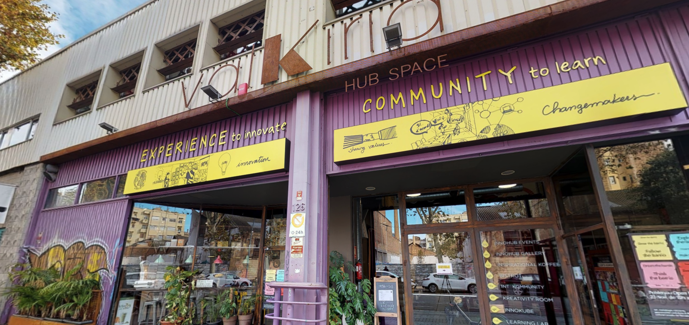

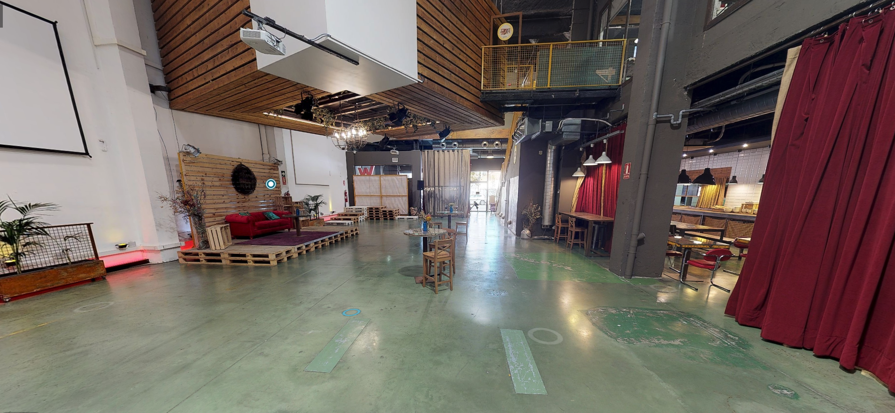

<style>
p.comment {
background-color: #ffcc99;
padding: 10px;
border: 1px solid black;
border-radius: 5px;
}
</style>

<p class="comment">
**Cocktail dinner including drinks, from: 41,50€ VAT inc**</p>

<style>
p.comment {
background-color: #ffcc99;
padding: 10px;
border: 1px solid black;
border-radius: 5px;
}
</style>

<p class="comment">
Venue rental fee: to be confirmed</p>

### Mamarosa Beach (activity + dinner)

Idyllically located in front of the beach, in the basement of the Hotel W Barcelona, Mamarosa Beach is an ideal option at any time.

The space has a large terrace and an interior dining room perfect for group dinners and all kinds of events. The restaurant has been decorated with taste and adapts wisely at every moment of the day. At night, Mamarosa Beach transforms into a vibrant place with cocktails and lively music.

The cuisine is Mediterranean with Italian influences and is made with fresh and natural ingredients, but for groups it can be a "total Spanish tapas menu"

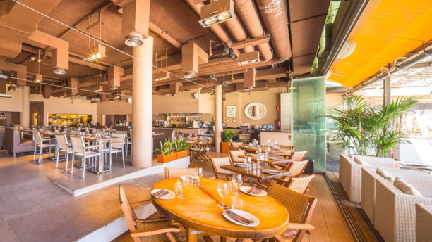

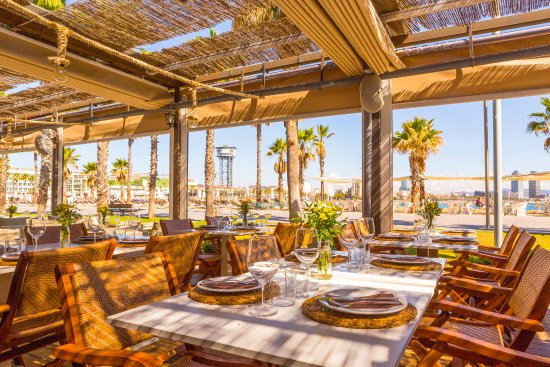

<style>
p.comment {
background-color: #ffcc99;
padding: 10px;
border: 1px solid black;
border-radius: 5px;
}
</style>

<p class="comment">
**Cocktail menu including drinks from 48,75€ VAT inc**</p>


<style>
p.comment {
background-color: #ffcc99;
padding: 10px;
border: 1px solid black;
border-radius: 5px;
}
</style>

<p class="comment">
**Venue rental from 17.00h to 19.00h to organize the activity: 1000€ VAT inc** // no drinks included during the activity</p>

****

### El Principal de l'Eixample

Located 50 meters from the famous La Pedrera and Paseo de Gracia, El Principal is a versatile space.

It is a stately main floor flooded with natural light thanks to its large windows. It has a magnificent interior courtyard is dividing the space in 2 but with good weather the whole venue has a capacity for 500 pax in cocktail style.

El Principal bases its cuisine in the traditional Catalan cuisine and seasonal products, and offer proposals developed especially for groups and special occasions. Also it has an extensive wine list.

On the basement it has a small private disco-club up to 150 pax, that can be used after dinner to extend the party.


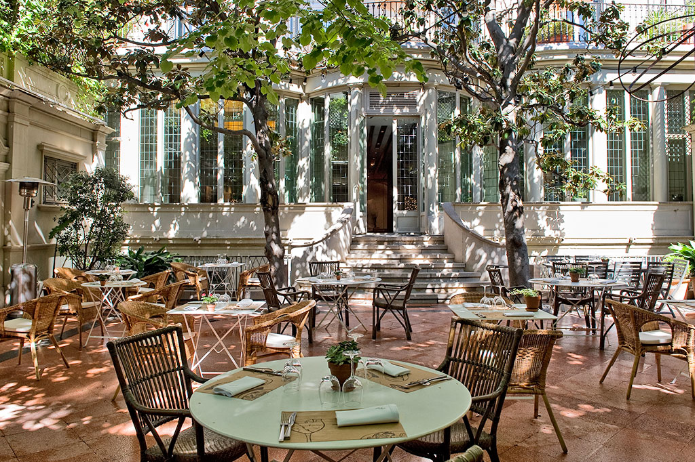

<style>
p.comment {
background-color: #ffcc99;
padding: 10px;
border: 1px solid black;
border-radius: 5px;
}
</style>

<p class="comment">
**Cocktail menu including drinks from 67€ VAT inc**</p>

****


## Terms & Conditions

  *Rates valid for the requested dates.
  
  *Net rates for CICERON
  
  *Valid for 300 pax
  
  *Cutting Edge Events management fee including in the detailed rates
  
  *VAT included. 
  
  *Only accommodation is confirmed, we will need to check all the other offered services avaolability upon confirmation.
  
    *Hotel Barcelona Princess Payment/cancellation policy:
  
    Deposits:
    40% before the 4th of June 2019
    30% before the 14th of June 2019
    30% before the 23th of September 2019
    

    Cancellations
    
    A 30% can be cancelled without cost from the confirmation until 14th June 2019
    A 10% can be cancelled without  cost from 15th June 2019 to 16th August 2019 
    A 5% can be cancelled without cost from 17th August to 22nd September
    From 23rd September the hotel will charge the 100% 

  
*****

